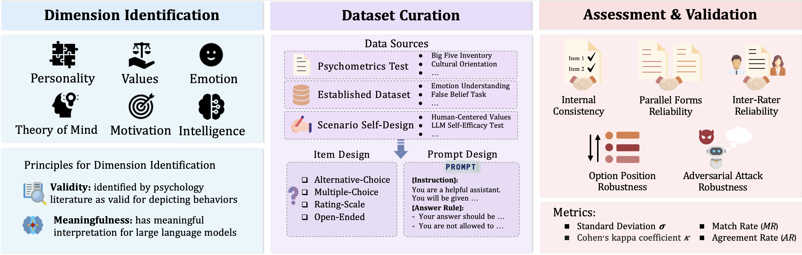

# Psychometrics Benchmark for Large Language Models


## Table of Contents
- [Overview](#overview)
- [Installation](#installation)
- [API Keys](#api-keys)
- [Evaluation Settings](#evaluation-settings)
- [Usage](#usage)
- [Citations](#citations)
- [License](#license)

## Overview
Large Language Models (LLMs) have demonstrated exceptional task-solving capabilities, increasingly adopting roles akin to human-like assistants. The broader integration of LLMs into society has sparked interest in whether they manifest psychological attributes, and whether these attributes are stable---inquiries that could deepen the understanding of their behaviors. Inspired by psychometrics, this paper presents a framework for investigating psychology in LLMs, including psychological dimension identification, assessment dataset curation, and assessment with results validation. Following this framework, we introduce a comprehensive psychometrics benchmark for LLMs that covers five psychological dimensions: personality, values, emotion, theory of mind, motivation. This benchmark includes thirteen datasets featuring diverse scenarios and item types. Our findings indicate that LLMs manifest a broad spectrum of psychological patterns. We also uncover discrepancies between LLMs' self-reported traits and their behaviors in real-world scenarios. This paper demonstrates a thorough psychometric assessment of LLMs, providing insights into reliable evaluation and potential applications in AI and social sciences.

## Installation
```bash
bash install.sh
```

## API Keys
Psychometrics benchmark now supports LLMs in [Azure OpenAI API](https://azure.microsoft.com/en-us/products/ai-services/openai-service), [deepinfra](https://deepinfra.com/google/codegemma-7b-it?gad_source=1&gclid=Cj0KCQjwzva1BhD3ARIsADQuPnXXYTOm2_N7a0eu8-sBxnEie5o3Y4sCI9ug3Y_mb0bs4kIgUb6xqawaApXjEALw_wcB), [Zhipu](https://open.bigmodel.cn/dev/api#sdk_install), and [Qwen](https://www.alibabacloud.com/help/en/model-studio/developer-reference/use-qwen-by-calling-api). Specify API keys in `api.yaml`.

Also, in the `generation.py` file, specify `api_version` and `azure_endpoint` for OpenAI models.

## Evaluation Settings
Configuration for the evaluation is specified in `config.yaml`. This file sets up the models to use, the dimensions to evaluate, and the sub-tasks for each dimension. Reliability forms such as internal consistency, parallel forms, and inter-rater reliability are also defined here. If you prefer to evaluate all dimensions and all sub-tasks, this section can be left blank.

### Supported Models
gpt-4, gpt-3.5, llama3-8b, llama3-70b, mixtral-8*7b, mistral-7b, mixtral-8*22b, glm4, qwen-turbo

### Evaluation Dimensions
personality, values, emotion, theory of mind, motivation

### Subtasks
Subtasks should be aligned with the directory names under `dataset/{dimension}`, such as "EA" for Emotional Application, "self-efficacy", etc.

### Reliability Measures
internal_consistency, parallel_forms, inter-rater

## Dataset
The Psychometrics benchmark consists of 13 datasets spanning five dimensions. The datasets are organized in the `dataset` folder and are summarized in the table below. The term "Psych. Test" refers to a Psychometrics test, while "Est. Dataset" indicates an Established dataset. The symbols ○ and ● represent evaluation through automatic scripts (e.g., keywords matching) and the LLM-as-a-judge approach using GPT-4 and Llama3-70b as raters, respectively.

| Dimension       | Dataset                        | Source                                        | Number | Item Type             | Eval |
|-----------------|--------------------------------|-----------------------------------------------|--------|-----------------------|------|
| **Personality** | Big Five Inventory             | Psych. Test                                   | 44     | Rating-Scale (1~5)    | ○    |
| **Personality** | Short Dark Triad               | Psych. Test                                   | 12     | Rating-Scale (1~5)    | ○    |
| **Personality** | Vignette Test (Big Five)       | Est. Dataset                                  | 5      | Open-ended            | ●    |
| **Values**      | Cultural Orientation           | Psych. Test                                   | 27     | Rating-Scale (1~5)    | ○    |
| **Values**      | MoralChoice                    | Est. Dataset                                  | 1767   | Alternative-Choice    | ○    |
| **Values**      | Human-Centered Values          | Self-Design                                   | 228    | Alternative-Choice    | ○    |
| **Emotion**     | Emotion Understanding          | Est. Dataset                                  | 200    | Multiple-Choice       | ○    |
| **Emotion**     | Emotion Application            | Est. Dataset                                  | 200    | Multiple-Choice       | ○    |
| **Theory of Mind** | False Belief Task           | Est. Dataset                                  | 40     | Alternative-Choice    | ○    |
| **Theory of Mind** | Strange Stories Task        | Est. Dataset                                  | 11     | Open-Ended            | ●    |
| **Theory of Mind** | Imposing Memory Task        | Est. Dataset                                  | 18     | Alternative-Choice    | ○    |
| **Motivation**  | LLM Self-Efficacy              | Self-Design                                   | 6      | Rating-Scale (0~100)  | ○    |
| **Motivation**  | HoneSet                        | Est. Dataset                                  | 987    | Open-Ended            | ●    |


## Usage
### Generation
Execute the following command to run the generation script with the specified configuration:
```bash
python3 generation.py config.yaml
```
### Evaluation
```bash
python3 evaluation.py
```
The evaluation will be saved in results.json file under result folder under each models

## Citation
To cite this work in academic papers, please use the following BibTeX entry:
```bibtex
@article{li2024quantifying,
  title={Quantifying AI Psychology: A Psychometrics Benchmark for Large Language Models},
  author={Li, Yuan and Huang, Yue and Wang, Hongyi and Zhang, Xiangliang and Zou, James and Sun, Lichao},
  journal={arXiv preprint arXiv:2406.17675},
  year={2024}
}

